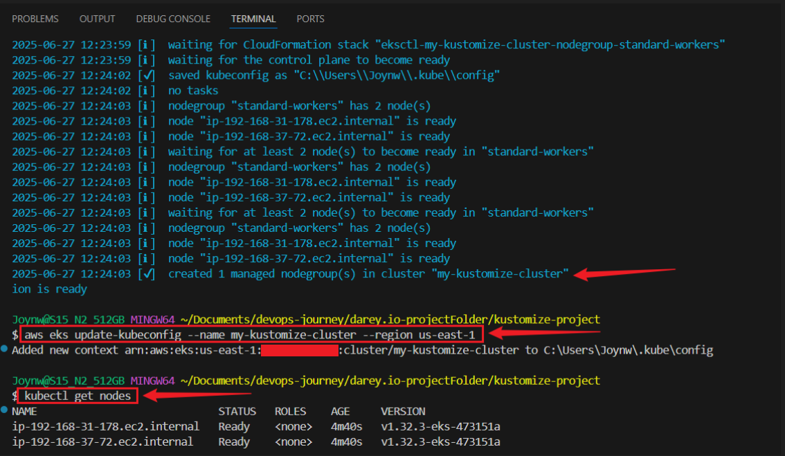

 # Advanced Kubernetes Configuration Management with Kustomize, AWS EKS, and GitHub Actions

> This project demonstrates **advanced configuration management** using **Kustomize** with **GitHub Actions CI/CD pipelines**, deployed to a **Kubernetes cluster on Amazon EKS**.

## Project Structure

```base
kustomize-project/
├── base/ 
│ ├── deployment.yaml
│ ├── service.yaml
│ └── kustomization.yaml
├── overlays/
│ └── production/ 
│ ├── deployment-patch.yaml
│ └── kustomization.yaml
└── .github/
└── workflows/
└── deploy.yml
```

## Aim 

- Defines a basic Kubernetes deployment (`nginx`) using **Kustomize**.
- Creates a **production overlay** with different configurations.
- Automatically **deploys to AWS EKS** when you push changes to `main` via **GitHub Actions**.


## Prerequisites

Make sure you have the following installed:

- [Docker](https://docs.docker.com/get-docker/)
- [kubectl](https://kubernetes.io/docs/tasks/tools/)
- [Kustomize](https://kubectl.docs.kubernetes.io/installation/kustomize/)
- [AWS CLI](https://docs.aws.amazon.com/cli/latest/userguide/install-cliv2.html)
- [eksctl](https://eksctl.io/)
- [Git + GitHub](https://github.com)
- [VS Code](https://code.visualstudio.com/)


## Project Setup

### Check Installed Tools:
```
docker --version
kustomize version
kubectl version --client
git --version
code --version
aws --version
eksctl version
aws configure
```


----

### Step 1: Create an EKS Cluster:

```bash
eksctl create cluster --name my-kustomize-cluster --region us-east-1 --nodegroup-name standard-workers --node-type t3.medium --nodes 2
```

### Connect kubectl to the Cluster:
- Update your kubectl config:
```bash
aws eks update-kubeconfig --name my-kustomize-cluster --region us-east-1
```

### Test It:
```bash
kubectl get nodes
```



----


## Step 2: Set Up Your GitHub Repository

### Create a Repository:

- Create a repository on GitHub.
- Name it `kustomize-project`, make it public or private, and click “Create repository”.

## Set Up Locally:
- Create a folder for the project:
```bash
mkdir kustomize-project
cd kustomize-project
```

- ### Connect it to GitHub:

```bash
git init
git add .
git commit -m "Initial commit with Kustomize project"
git branch -m master main
git remote add origin https://github.com/yourusername/your-repository.git
git push -u origin main
```

## Create Folder Structure:
```bash
mkdir -p .github/workflows base overlays/production
```

----


## Step 3: Create a Simple Kubernetes App with Kustomize

### Create Base Configuration:

- #### Create a file `base/deployment.yaml`:
```bash
touch base/deployment.yaml
```

#### Paste:
```bash
apiVersion: apps/v1
kind: Deployment
metadata:
  name: my-app
spec:
  replicas: 1
  selector:
    matchLabels:
      app: my-app
  template:
    metadata:
      labels:
        app: my-app
    spec:
      containers:
      - name: app-container
        image: nginx:latest
```


## Create a file `base/service.yaml`:
```bash
touch base/service.yaml
```

#### Paste:
```bash
apiVersion: v1
kind: Service
metadata:
  name: my-app-service
spec:
  selector:
    app: my-app
  ports:
  - protocol: TCP
    port: 80
    targetPort: 80
  type: LoadBalancer
```

## Create a file `base/kustomization.yaml`:
```bash
touch base/kustomization.yaml
```

#### Paste:
```bash
apiVersion: kustomize.config.k8s.io/v1beta1
kind: Kustomization
resources:
- deployment.yaml
- service.yaml
```

## Create `Production Overlay`:

- #### Create a file `overlays/production/deployment-patch.yaml`:
```bash
touch overlays/production/deployment-patch.yaml
```

#### Paste:
```bash
apiVersion: apps/v1
kind: Deployment
metadata:
  name: my-app
spec:
  replicas: 3
```

## Create a file `overlays/production/kustomization.yaml`
```bash
touch overlays/production/kustomization.yaml
```

#### Paste:
```bash
apiVersion: kustomize.config.k8s.io/v1beta1
kind: Kustomization
bases:
- ../../base
patchesStrategicMerge:
- deployment-patch.yaml
```

## Test Locally (in kustomize-project folder:):

```bash
kustomize build overlays/production
```


## Step 4: Set Up GitHub Actions CI/CD Pipeline

## Create Workflow File:
- #### Create a file `.github/workflows/main.yml`
```bash
touch .github/workflows/main.yml
```

#### Paste:
```bash
     name: Deploy with Kustomize
     on:
       push:
         branches:
           - main
     jobs:
       deploy:
         runs-on: ubuntu-latest
         steps:
         - name: Checkout
           uses: actions/checkout@v4
         - name: Cache Docker layers
           uses: actions/cache@v4
           with:
             path: /tmp/.buildx-cache
             key: ${{ runner.os }}-buildx-${{ github.sha }}
             restore-keys: |
               ${{ runner.os }}-buildx-
         - name: Set up kubectl
           uses: azure/setup-kubectl@v1
         - name: Set up Kustomize
           uses: imranismail/setup-kustomize@v1
         - name: Configure AWS Credentials
           uses: aws-actions/configure-aws-credentials@v1
           with:
             aws-access-key-id: ${{ secrets.AWS_ACCESS_KEY_ID }}
             aws-secret-access-key: ${{ secrets.AWS_SECRET_ACCESS_KEY }}
             aws-region: us-east-1
         - name: Update kubeconfig
           run: aws eks update-kubeconfig --name my-kustomize-cluster --region us-east-1
         - name: Deploy to Kubernetes
           run: kubectl apply -k ./overlays/production/
```


## Add AWS Secrets to GitHub:

- Go to your GitHub repository, click “Settings” > “Secrets” > “Actions” > “New repository secret”.

- Add two secrets:
   - Name: `AWS_ACCESS_KEY_ID`, Value: Your AWS Access Key ID.
   - Name: `AWS_SECRET_ACCESS_KEY`, Value: Your AWS Secret Access Key.
- You get these from AWS Console under IAM > Users > Your User > Security credentials.


### Push to GitHub:
```
git add .
git commit -m "Add Kustomize app and GitHub Actions"
git push origin main
```

## Check the Pipeline:
 - Go to your GitHub repository, click “Actions” tab.
 - You’ll see the “Deploy with Kustomize” workflow running. Click it to see logs.
 - If it works, your app is in the EKS cluster!


## Step 5: Add ConfigMap and Secret with Kustomize

### Add ConfigMap to Base
  - Edit `base/kustomization.yaml` to add a ConfigMap: 
 ```bash
apiVersion: kustomize.config.k8s.io/v1beta1
kind: Kustomization
resources:
- deployment.yaml
- service.yaml
configMapGenerator:
- name: my-app-config
  literals:
  - app_name=MyKustomizeApp
  - log_level=debug
 ```


## Update base/deployment.yaml to use the ConfigMap:
```bash
        envFrom:
        - configMapRef:
            name: my-app-config
```

## Add Secret to Base:
- Edit `base/kustomization.yaml` again to add a Secret:
```bash
secretGenerator:
- name: my-app-secret
  literals:
  - username=admin
  - password=VGhpc01zU2VjcmVeIQ== 
```

- ## Update `base/deployment.yaml` to use the Secret:
```bash
        - secretRef:
            name: my-app-secret
```

## Test and Push:
 - Test locally:
```bash
kustomize build overlays/production
```

- ### Push changes:
```bash
git add .
git commit -m "Add ConfigMap and Secret"
git push origin main
```

## Step 6: Optimize and Test the Pipeline
### Add Caching to GitHub Actions:
- Edit `.github/workflows/main.yml` to add caching for faster builds:
```bash
name: Deploy with Kustomize
on:
  push:
    branches:
      - main
jobs:
  deploy:
    runs-on: ubuntu-latest
    steps:
    - name: Checkout
      uses: actions/checkout@v2
    - name: Cache Docker layers
      uses: actions/cache@v2
      with:
        path: /tmp/.buildx-cache
        key: ${{ runner.os }}-buildx-${{ github.sha }}
        restore-keys: |
          ${{ runner.os }}-buildx-
    - name: Set up kubectl
      uses: azure/setup-kubectl@v1
    - name: Set up Kustomize
      uses: imranismail/setup-kustomize@v1
    - name: Configure AWS Credentials
      uses: aws-actions/configure-aws-credentials@v1
      with:
        aws-access-key-id: ${{ secrets.AWS_ACCESS_KEY_ID }}
        aws-secret-access-key: ${{ secrets.AWS_SECRET_ACCESS_KEY }}
        aws-region: us-east-1
    - name: Update kubeconfig
      run: aws eks update-kubeconfig --name my-kustomize-cluster --region us-east-1
    - name: Deploy to Kubernetes
      run: kubectl apply -k ./overlays/production/
```

## Check the App in EKS:
- Get the service URL to see your app:
```bash
kubectl get svc my-app-service
```
**open the `EXTERNAL-IP` on browser**


## Test Pipeline:
- Updating `overlays/production/deployment-patch.yaml` to 4 replicas:
```bash
  replicas: 4
```

- ### Push the change:
```bash
git add .
git commit -m "Increase replicas to 4"
git push origin main
```
**Check the GitHub Actions log to see it deploy.**

- ### Verify in EKS:
```bash
kubectl get pods
```

## Step 7: Clean Up

### Delete EKS Cluster:
```bash
eksctl delete cluster --name my-kustomize-cluster --region us-east-1
```


### Push to Github
```
git add .
git commit -m "update file"
git push
```


## Conclusion

This project showcases how to manage Kubernetes deployments efficiently using Kustomize, GitHub Actions, and Amazon EKS. It sets up a clear, automated CI/CD workflow with environment-specific configurations, making deployments more reliable, scalable, and production-ready. 


### Author
### Joy Nwatuzor

### Credits & Resources
 - Kustomize Docs

 - AWS EKS Guide

 - GitHub Actions Docs


 ### Contribute

Pull requests are welcome! If you find issues or want to improve the workflow, feel free to fork and contribute.